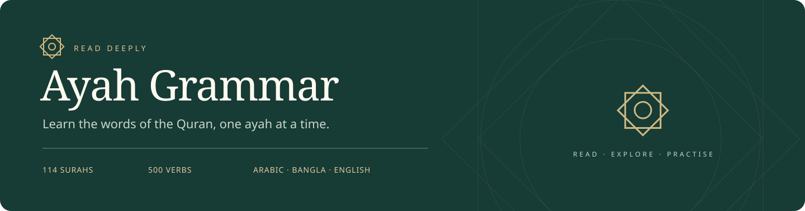
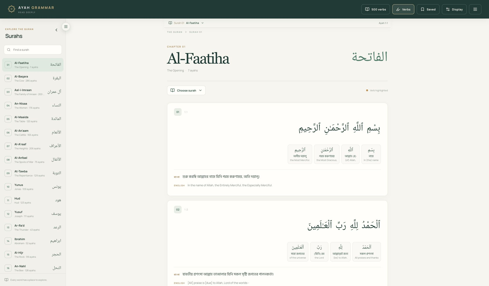
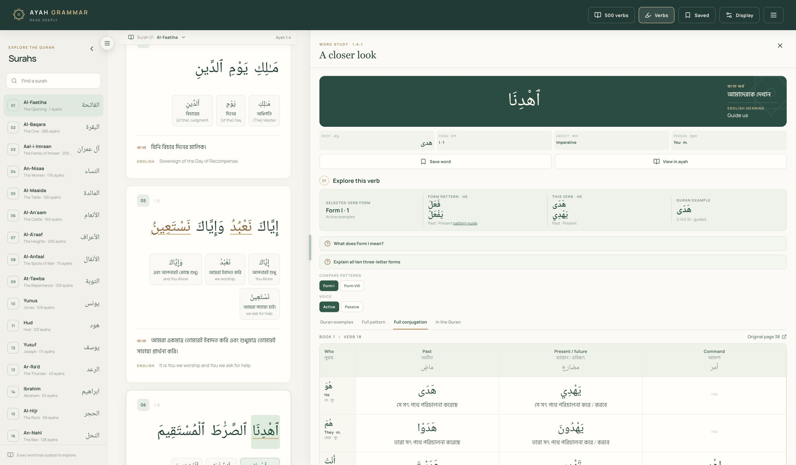
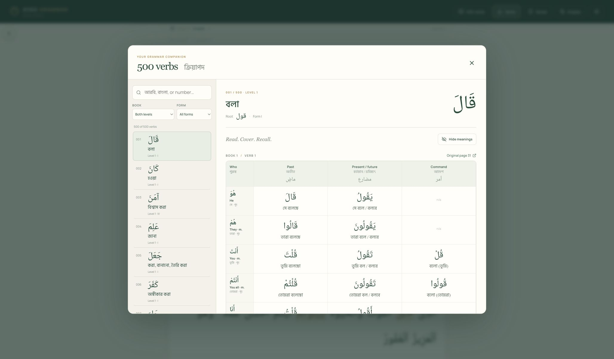
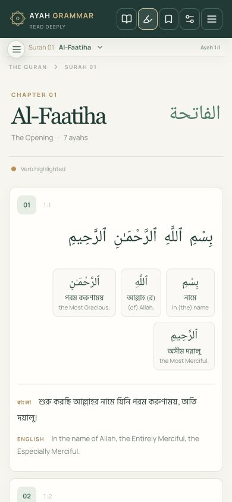
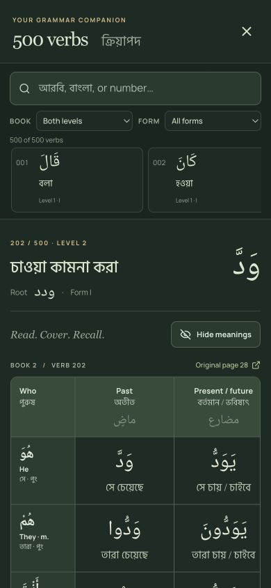
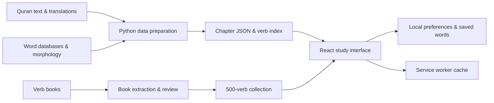

<p align="center">
  
</p>

<p align="center">
  <strong>A Quran reader that makes room for understanding every word.</strong><br />
  Arabic text · Bangla & English meanings · Grammar study · 500 verbs
</p>

<p align="center">
  <a href="#a-look-inside">Screenshots</a> ·
  <a href="#what-you-can-do">Features</a> ·
  <a href="#run-it-locally">Get started</a> ·
  <a href="#how-it-works">Architecture</a> ·
  <a href="#sources--credits">Sources</a>
</p>

## Why I built it

I built Ayah Grammar to bring Quran reading and Arabic grammar study into the same place. I wanted to read an ayah, tap a word, understand its root and structure, and see how it appears elsewhere in the Quran—without losing my place.

Bangla is central to the experience, alongside English. My focus is a calm reading space, useful explanations, and study material that stays connected to its sources.

## A look inside

### Read with meaning



### Follow a word into its grammar



### Build familiarity with 500 verbs



<table>
  <tr>
    <th>Reading on a phone</th>
    <th>Studying in dark mode</th>
  </tr>
  <tr>
    <td align="center"></td>
    <td align="center"></td>
  </tr>
</table>

*Screenshots are from the running app. The layout adapts from a desktop study workspace to a phone-sized reader.*

## What you can do

| Read | Explore | Practise |
| --- | --- | --- |
| Browse all **114 surahs** | Tap an Arabic word or its gloss | Search **500 numbered verbs** |
| See Bangla and English word meanings | Inspect root, word type and morphology | Study **6,978 supplied conjugation meanings** |
| Read complete ayah translations | Compare verb forms and active/passive occurrences | Filter by book level and verb form |
| Highlight verbs while reading | Follow cited examples back to their ayahs | Hide meanings and test your recall |
| Keep your current surah and ayah in view | Compare past, present/future and command forms | Open the original book page for a chart |

### A reading space that adapts

- **Light, dark and system themes**, with adjustable text size.
- **Independent meaning controls** for Bangla, English, word glosses and verb study.
- **Resizable desktop panels** and a collapsible surah sidebar.
- **A mobile study sheet** with charts that scroll inside the panel.
- **Saved words** and reading preferences stored in your browser.
- **Installable PWA** with cached app assets and previously opened content available offline. Chapters are cached as you open them; the entire Quran is not pre-downloaded.
- **No account, API key or application backend** required.

### Three ways to study a verb

| View | What it shows |
| --- | --- |
| **Quran examples** | Forms actually attested in the morphology corpus, with contextual meanings and ayah references. An empty applicable slot stays empty. |
| **Full pattern** | Reference conjugations using the teaching roots فعل and فعلل. |
| **Full conjugation** | The matching book chart with Bangla meanings, plus an optional generated Arabic chart with the wider set of persons. |

The book collection supplies masculine and first-person forms. Feminine, dual and passive Bangla meanings are left absent where the books do not supply them. The two readings of entry 374 are both preserved, giving **501 readings across 500 numbered entries**. Two entries have no conjugation table, and one has past forms only.

Book transcriptions have completeness checks and targeted visual review; they have not all been independently proofread. Source links and review notes make unusual entries easier to check.

## Run it locally

**Requirements:** Node.js 20.19+ or 22.12+, npm, and Python 3 for the data checks.

```bash
git clone https://github.com/kamalahmed/ayah-grammar.git
cd ayah-grammar
npm ci
npm run dev
```

Open **http://localhost:4173**. All application datasets are included, so the reader works without downloading or preparing a database first.

```bash
npm test          # App tests and source-data alignment checks
npm run build     # Type-check and build the production app
npm run preview   # Serve the production build locally
```

For PWA installation, serve the production build over HTTPS or use localhost. The development server also prints a local-network address for trying the responsive interface on another device.

## How it works



| Layer | My choices |
| --- | --- |
| Interface | React 19, TypeScript, Vite, Lucide icons |
| Typography | Noto Naskh Arabic, Hind Siliguri, Manrope |
| Data preparation | Python, SQLite source databases, static JSON |
| Book extraction | PDF table geometry, embedded-font glyph recovery, Bengali OCR, recorded corrections |
| Study patterns | Corpus-matched citations and Qutrub conjugation data |
| Persistence | Browser local storage and a service worker cache |
| Verification | Vitest and Python `unittest` |

Each word is identified by **surah, ayah and word position**. Chapters load on demand, and the verb occurrence index loads when verb study is first opened. Book meanings are matched by root, form, voice, aspect, person and Arabic spelling before being attached to a generated chart.

### Repository guide

```text
src/                 Reader, study panels, themes and conjugation datasets
public/data/         All 114 chapters, chapter metadata and verb occurrences
public/books/        Original reference PDFs linked from the study charts
data/raw/            Source text, translations, morphology and SQLite databases
data/books/          Full 500-verb export with provenance, plus CSV
scripts/             Data preparation, conjugation and book-extraction tools
tests/               Source-data alignment checks
docs/                Source notes, roadmap and screenshots
```

Rebuild the reader data with `npm run data:build`. Re-import the bundled book export with `python3 scripts/build_book_verb_meanings.py`. See [Data preparation](docs/DATA_PREPARATION.md) for the extraction workflow and [Content sources](docs/CONTENT_SOURCES.md) for data handling details.

## Sources & credits

I built the study interface around the work of these projects and contributors:

- **[Tanzil](https://tanzil.net/):** Quran text and translation downloads.
- **Saheeh International and Muhiuddin Khan:** English and Bengali ayah translations.
- **[Quranic Arabic Corpus](https://corpus.quran.com/):** word-level roots, morphology and occurrence references.
- **[Greentech Apps Foundation](https://github.com/GreentechApps/Al-Quran):** English and Bengali word databases.
- **[Qutrub](https://github.com/linuxscout/qutrub):** Arabic reference conjugations.
- **Quran words, Levels 1 and 2:** the Arabic–Bangla book charts in the verb library.

Third-party text, translations, databases and books retain their original ownership and applicable terms. Repository availability does not grant a new license to those materials. Original source notices are retained in [NOTICES.txt](public/NOTICES.txt).

---

Built by **[Kamal Ahmed](https://github.com/kamalahmed)** · [What I’m working toward](docs/ROADMAP.md)
